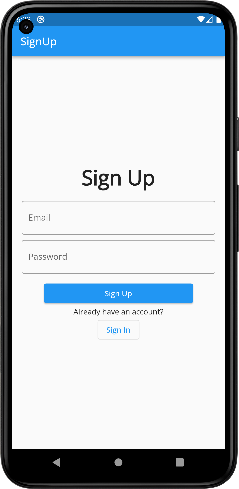
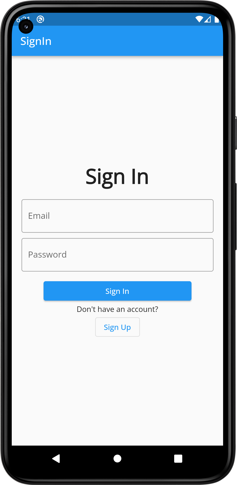
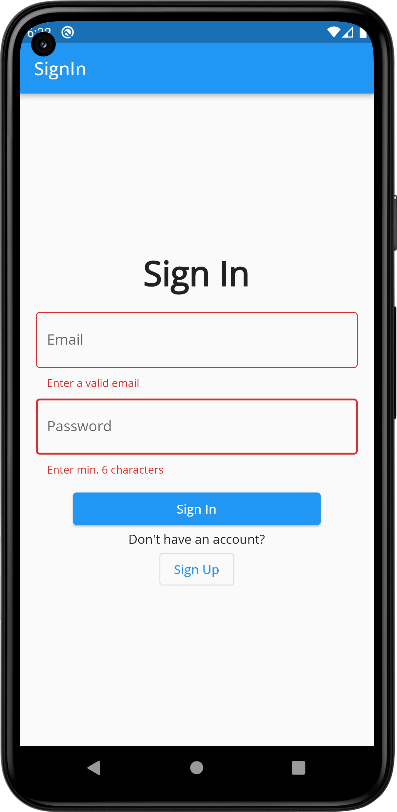
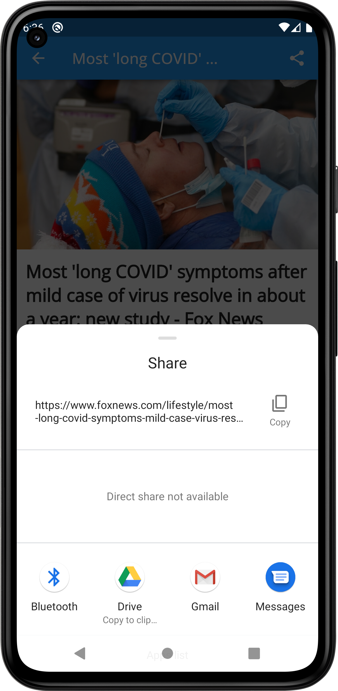

# Newspaper App
API from News API [https://newsapi.org/](https://link-url-here.org)
# Screenshot
  

  

# Dependencies
  bloc: ^8.1.0 
  flutter_bloc: ^8.1.1 
  firebase_core: ^2.4.1 
  firebase_auth: ^4.2.5 
  equatable: ^2.0.5 
  email_validator: ^2.1.17 
  http: ^0.13.5 
  google_fonts: ^3.0.1 
  date_format: ^2.0.7 
  cached_network_image: ^3.2.3 
  url_launcher: ^6.1.7 
  share_plus: ^6.3.0 
  
# APK File
[Apk link](https://github.com/sabiruzzaman/Newspaper-App/tree/master/apk)
